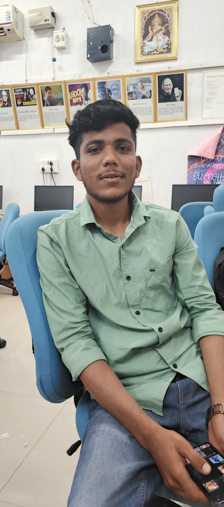
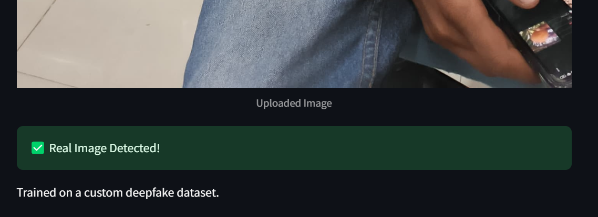
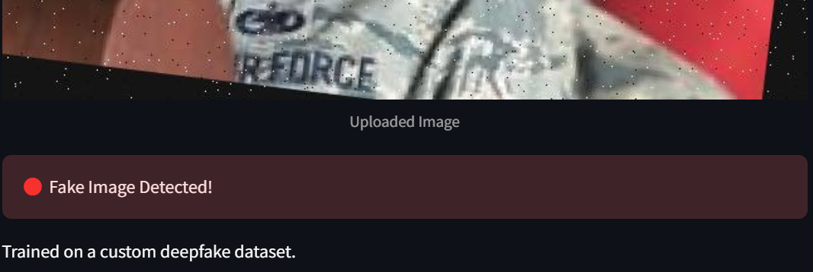
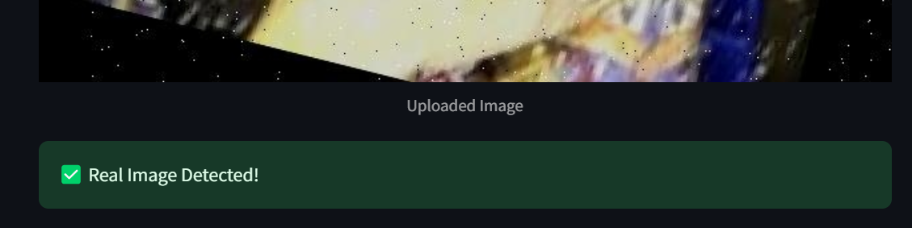
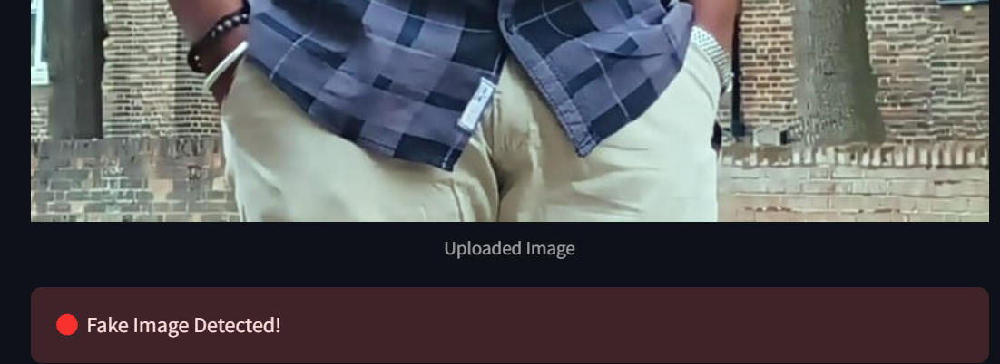

# 🎭 Deepfake Face Detector – Real or Synthetic? Let AI Decide.


**🔍 "Can you spot the fake? We can. Instantly."**

Deepfake Face Detector is a browser-based app built with Streamlit that uses AI to detect deepfakes in real-time. Upload a face image or frame from a video and get an instant answer with visual feedback — no coding, no setup, just click and know.

---

## 🧠 Core Features
📷 Image Upload Support – Upload any face image or extracted frame.

🧪 Deepfake Detection Engine – A trained CNN model analyzes facial features for anomalies.

🎨 Streamlit UI – Clean, responsive interface that runs locally or on the cloud.

🧾 Result with Confidence Score – Know if it's fake and how fake it is.

---


## Download the model:

[Click here to download model](https://drive.google.com/file/d/1-4n_KQb-bwx65JqmvQaKpNgzJey5gm66/view?usp=sharing)

Place deppfake_detector.h5 in the project root folder.

---

## 📸 Try It Live (Locally)
``` bash
# 1. Clone the repo
git clone https://github.com/n-bharath-chowdary/Deepfake-Detector.git
cd Deepfake-Detector

# 2. Set up environment
python -m venv venv
source venv/bin/activate  # or use `venv\Scripts\activate` on Windows

# 3. Install dependencies
pip install -r requirements.txt

# 4. Launch the app
streamlit run app.py
```
---
## 🖼️ Sample Output

| Input | Output  |
|------------|-----------|
|  |  |
|  |  |
|  |  |
|  |  |

---

## 🛠️ Built With
Streamlit – for web app

OpenCV & dlib – face detection

Keras/TensorFlow – deepfake classification model

NumPy, Pillow – image processing

---

## 🎯 Use Cases
🕵️‍♂️ Digital forensics & journalism

📲 Media authenticity verification

🧑‍💻 Portfolio & AI showcase project

🔐 Deepfake awareness education tool

---
## 📢 Contribute

Got ideas? Found a bug?
Open an Issue or submit a Pull Request – all contributions are welcome!


---

## 📄 License

This project is licensed under the MIT License. See the LICENSE file for details.


---

## 💬 Connect

## 🙋‍♂️ Author
#### Bharath Chowdary
##### [GitHub](https://github.com/n-bharath-chowdary) 
##### [LinkedIn](https://www.linkedin.com/in/n-bharath-chowdary/)
---
